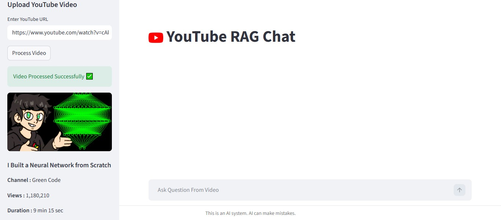
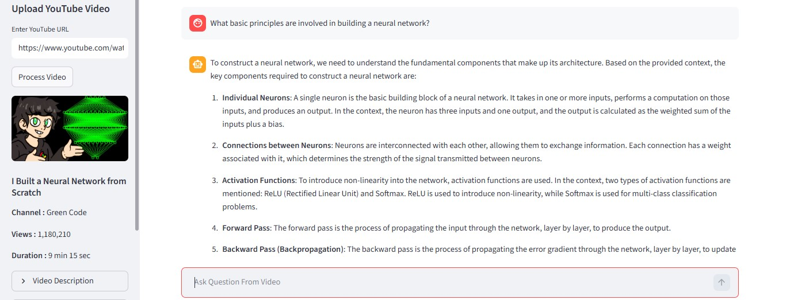
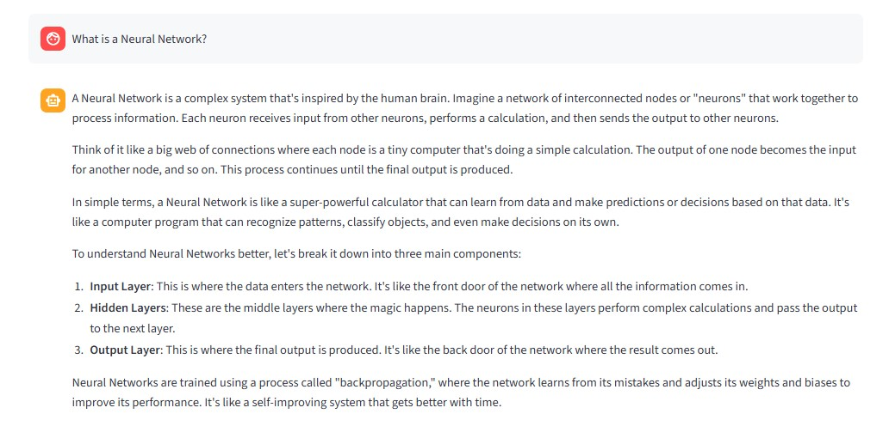
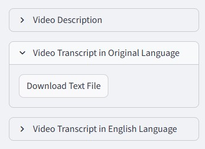

<div align="center">

# 🎥 YouTube RAG Chat

# 🧠 AI Powered YouTube Question Answering System

Ask questions directly from any YouTube video using  
**RAG (Retrieval Augmented Generation)**, **LangChain**, **Groq LLM**, and **ChromaDB**.

Built with scalable multi-user session support and multilingual transcript processing.

**(Installation Given Below)**

</div>

---

# ✨ Features

<table>
<tr>
<td width="60%">

## 🎥 Upload Any YouTube Video

- Upload any YouTube video using URL
- Supports multilingual videos
- Automatic transcript extraction
- Clean and interactive Streamlit UI

</td>

<td width="40%">



</td>
</tr>
</table>

---

<table>
<tr>
<td width="60%">

## 🤖 AI Powered Video Chat

- Ask questions directly from video content
- Context-aware conversation
- Smart retrieval using RAG pipeline
- Query rewriting for better answers
- Groq LLM powered responses

</td>

<td width="40%">



</td>
</tr>
</table>

---

<table>
<tr>
<td width="60%">

## 🧠 Deep Concept Understanding

- Understand complex topics easily
- AI explains concepts from video transcript
- Better semantic retrieval using embeddings
- Helpful for learning from educational videos

</td>

<td width="40%">



</td>
</tr>
</table>

---

<table>
<tr>
<td width="60%">

## 📄 Transcript Support

- View transcript in original language
- English translated transcript support
- Download transcript as `.txt` file
- Expandable transcript sections

</td>

<td width="40%">



</td>
</tr>
</table>

---

# 🚀 Tech Stack

## Frontend
- Streamlit

## Backend / AI
- LangChain
- Groq API
- ChromaDB
- HuggingFace Embeddings
- Llama 3.1 8B Instant

## Utilities
- youtube-transcript-api
- yt-dlp
- googletrans
- httpx

---

# ⚡ How It Works

## Step 1 — Upload Video
User enters a YouTube video URL.

## Step 2 — Extract Transcript
Transcript is extracted automatically using:

- `youtube-transcript-api`

## Step 3 — Language Translation
If the transcript is not in English:

- It gets translated using `googletrans`

## Step 4 — Text Chunking
Transcript is split into smaller chunks using:

- `RecursiveCharacterTextSplitter`

## Step 5 — Create Embeddings
Embeddings are generated using:

- `all-MiniLM-L6-v2`

## Step 6 — Store in Vector Database
Chunks are stored in:

- `ChromaDB`

## Step 7 — Ask Questions
Users can ask questions from the video.

## Step 8 — RAG Pipeline
The system:

- Rewrites user query
- Retrieves relevant chunks
- Sends context to Groq LLM
- Generates final AI response

---

# 👥 Multi User Session Support

Every user gets a unique session ID using UUID.

This ensures:

- Separate vector databases
- No chat overlap
- Safe concurrent usage
- Scalable deployment

---

# 📌 Main Features

## 🎬 Video Information
- Thumbnail
- Video Title
- Channel Name
- Views
- Duration
- Description

## 📄 Transcript Features
- Original Language Transcript
- English Language Transcript
- Downloadable `.txt` files

## 💬 AI Chat Features
- Context-aware conversation
- Smart retrieval
- Query rewriting
- AI-generated explanations

---

# 📂 Project Structure

```bash
.
├── streamlit.py
├── data_ingestion.py
├── RAG_retriever.py
├── utilities.py
├── requirements.txt
├── README.md
└── screenshots/
    ├── 1.jpg
    ├── 2.jpg
    ├── 3.jpg
    └── 4.jpg
```

---

# ⚙️ Installation

## 1️⃣ Clone Repository

```bash
git clone https://github.com/your-username/youtube-rag-chat.git

cd youtube-rag-chat
```

---

## 2️⃣ Create Virtual Environment

```bash
python -m venv venv
```

### Activate Environment

### Windows
```bash
venv\Scripts\activate
```

### Linux / Mac
```bash
source venv/bin/activate
```

---

## 3️⃣ Install Dependencies

```bash
pip install -r requirements.txt
```

---

# ▶️ Run The Application

```bash
streamlit run streamlit.py
```

---

# 🤖 Models Used

| Component | Model |
|---|---|
| Embedding Model | all-MiniLM-L6-v2 |
| LLM | llama-3.1-8b-instant |
| Vector Database | ChromaDB |

---

# 📦 Requirements

```txt
streamlit
youtube-transcript-api
yt-dlp
langchain
langchain-core
langchain-community
langchain-text-splitters
langchain-huggingface
langchain-chroma
langchain-groq
chromadb
sentence-transformers
transformers
torch
huggingface-hub
googletrans==4.0.0rc1
httpx
python-dotenv
```

---


# 👨‍💻 Author

## Made by Kunsh Bhatia

- GitHub: https://github.com/kunshbhatia/Youtube-RAG

---

# ⚠️ Disclaimer

This is an AI-powered system and may occasionally generate incorrect answers.

Always verify important information independently.

---

# ⭐ Support

If you found this project useful:

- ⭐ Star the repository
- 🍴 Fork the project
- 🛠️ Contribute improvements
- 📢 Share with others
